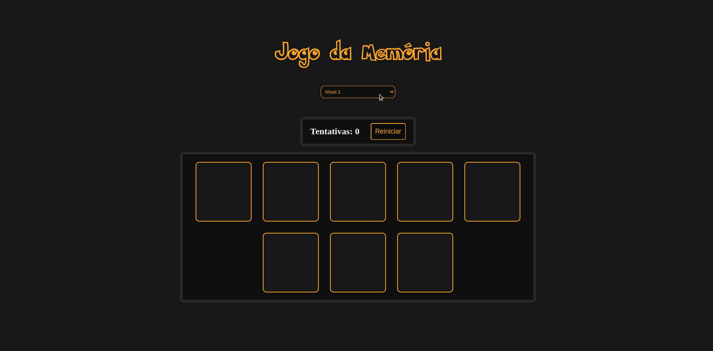

# JOGO DA MEMÓRIA
<p align='center'>Um jogo, onde todas as cartas, começam viradas de costas e o seu objetivo é encontrar todas as cartas iguais.</p>



### Regras do jogo
* O jogo começa com todas as cartas viradas de costas
* você deve virar duas cartas
* se as cartas forem iguais, mantenha-as viradas, se não desvire-as
* para ganhar, você deve virar todos os pares de cartas
* seu objetivo é concluir o jogo, no menor número de tentatívas possível

## 🤖 Tecnologias Utilizadas
* React
* TypeScript
* styled-components
* vite
* ESLint
* Prettier

## 💻 Pré-requisitos
Antes de começar, verifique se você atendeu oas seguintes requisitos:
* Ter um gerenciador de pacotes instalado, como: yarn ou npm
* Ter o git instalado

## 🚀 Instalando o jogo da memória
Para clonar este repositório siga os seguintes passos:
* abra o terminal na pasta desejada
* digite o seguinte comando:
```
git clone https://github.com/RamonPessoa/portifolio.git
```

## ☕ Usando o Jogo da Memória
Utilize os seguintes comandos no terminal na pasta do repositório clonado:
```html
yarn
<!-- Iinstala todas as dependencias com o yarn -->

OU npm install
<!-- instala todas as dependencias com npm -->
```
## Após instalar as dependências:
```html
yarn dev  <!-- Inicia o servidor de desenvolvimento-->
yarn build  <!-- constrói o projeto para produção-->
yarn preview  <!-- Inicia o servidor para preview em produção-->

OU npm run dev  <!-- Inicia o servidor de desenvolvimento-->
npm run build  <!-- constrói o projeto para produção-->
npm run preview  <!-- Inicia o servidor para preview em produção-->
```
